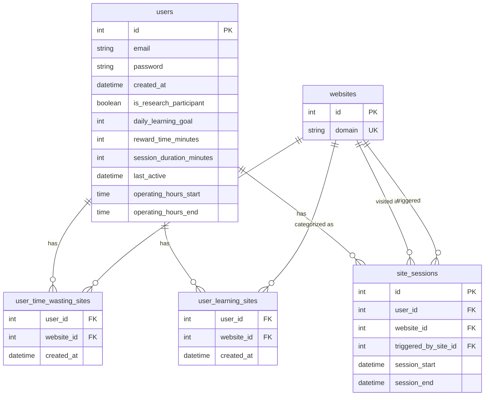

```mermaid
erDiagram
    users {
        int id PK
        string email
        string password
        datetime created_at
        boolean is_research_participant
        int daily_learning_goal
        int reward_time_minutes
        int session_duration_minutes
        datetime last_active
        time operating_hours_start
        time operating_hours_end
    }

    websites {
        int id PK
        string domain UK
    }

    user_time_wasting_sites {
        int user_id FK
        int website_id FK
        datetime created_at
    }

    user_learning_sites {
        int user_id FK
        int website_id FK
        datetime created_at
    }

    site_sessions {
        int id PK
        int user_id FK
        int website_id FK
        int triggered_by_site_id FK
        datetime session_start
        datetime session_end
    }

    users ||--o{ user_time_wasting_sites : "has"
    users ||--o{ user_learning_sites : "has"
    websites ||--o{ user_time_wasting_sites : "categorized as"
    websites ||--o{ user_learning_sites : "categorized as"
    users ||--o{ site_sessions : "has"
    websites ||--o{ site_sessions : "visited in"
    websites ||--o{ site_sessions : "triggered"
```